# 📘 MarlinSpike Enterprise OT Security Platform — Complete User Manual

> **Version**: `3.8.0`  
> **Target Audience**: OT Security Engineers, Incident Responders, SOC Analysts, Plant Automation Engineers, and Compliance Auditors.

---

## 📋 Table of Contents
1. [Platform Overview & Architecture](#1-platform-overview--architecture)
2. [Getting Started & Authentication](#2-getting-started--authentication)
3. [Project Management & Cross-Report Aggregation](#3-project-management--cross-report-aggregation)
4. [PCAP Ingestion, Live Capture & Fleet Agents](#4-pcap-ingestion-live-capture--fleet-agents)
5. [The Analyst Workbench & Topology Viewer](#5-the-analyst-workbench--topology-viewer)
   - [Multi-Lens Relational Graphing](#multi-lens-relational-graphing)
   - [High-Performance HMI (HP-HMI) Mode](#high-performance-hmi-hp-hmi-mode)
   - [Time Scrubbing & Sub-PCAP Extraction](#time-scrubbing--sub-pcap-extraction)
6. [Threat Intelligence & IOC Threat Hunting](#6-threat-intelligence--ioc-threat-hunting)
7. [Vulnerability Management & CISA KEV Correlation](#7-vulnerability-management--cisa-kev-correlation)
8. [MITRE ATT&CK® for ICS & Detection Coverage](#8-mitre-attck-for-ics--detection-coverage)
9. [Enterprise Export & Incident Response Pipelines](#9-enterprise-export--incident-response-pipelines)
   - [OASIS STIX 2.1 Threat Intel Exporter](#oasis-stix-21-threat-intel-exporter)
   - [Automated Ansible Incident Response Playbooks](#automated-ansible-incident-response-playbooks)
   - [Zero-Trust Firewall ACL Exporter](#zero-trust-firewall-acl-exporter)
   - [PCAP Patch Verification & Diff Engine](#pcap-patch-verification--diff-engine)
10. [Administration, Role-Based Access & Audit Logging](#10-administration-role-based-access--audit-logging)

---

## 1. Platform Overview & Architecture

**MarlinSpike** is a passive, multi-user Operational Technology (OT) and Industrial Control System (ICS) network triage and security assessment platform. It transforms raw packet captures (`.pcap` / `.pcapng`) into responder-grade topology graphs, asset inventories, risk findings, and compliance reporting without injecting a single packet onto the physical control network.

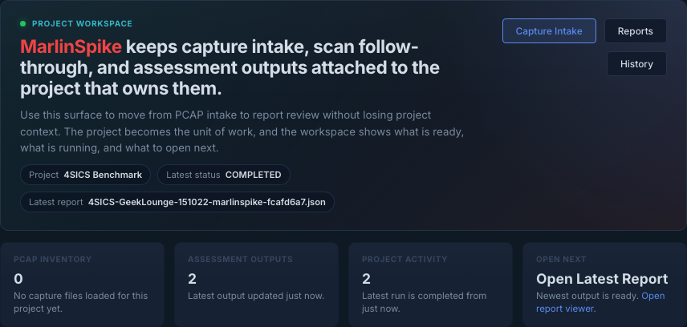

### Key Architectural Principles:
* **Passive Analysis Only**: Zero active probes or packet generation. Safe for safety-critical Level 0 / Level 1 PLCs, RTUs, and IEDs.
* **Multi-User Collaboration**: Shared URLs, RBAC access roles (`viewer`, `editor`, `owner`), project isolation, and session persistence.
* **Hybrid DPI Engine**: Accelerated Rust DPI substrate (`marlinspike-dpi`) running 34 protocol dissectors alongside a Python fallback pipeline.
* **Open Standard Exports**: Native emitting to OASIS STIX 2.1, OCSF v1.4.0, Sigma rules, Ansible playbooks, and Zero-Trust firewall rules.

---

## 2. Getting Started & Authentication

To access MarlinSpike, navigate to `http://<your-marlinspike-host>:5001` in any web browser.

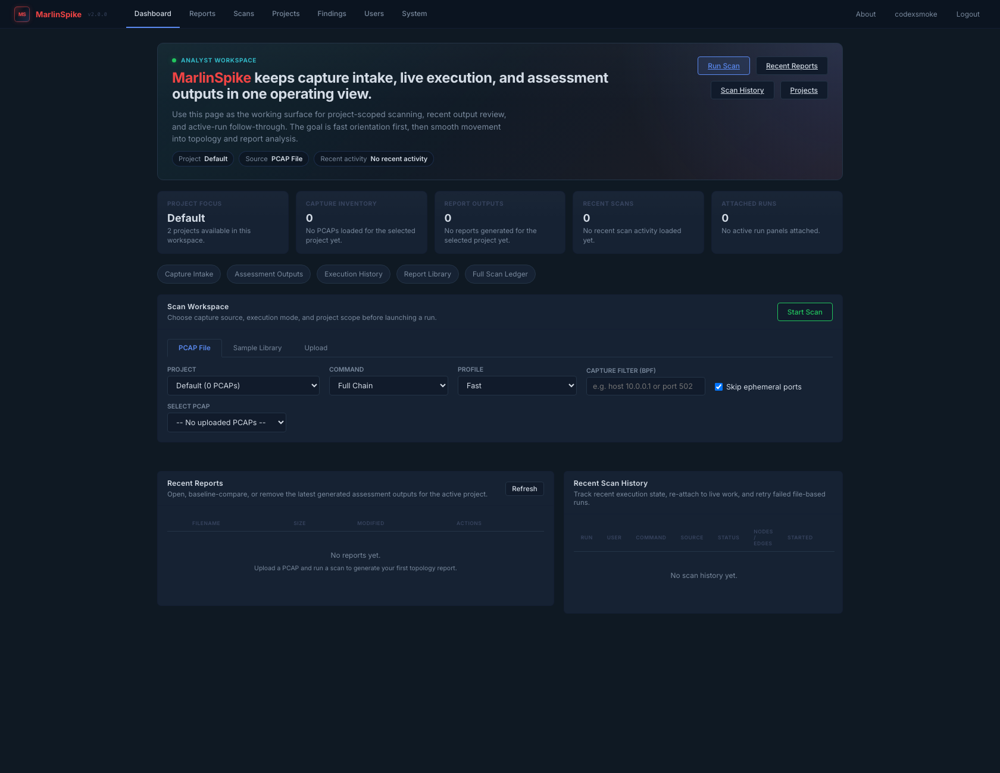

### User Role Hierarchy:
| Role | Capabilities |
| :--- | :--- |
| **Viewer** | Read-only access to assigned projects, reports, topology maps, and export downloads. |
| **Editor** | Upload PCAPs, trigger scans, edit asset context/notes, update vulnerability triage status, and manage IOC lists. |
| **Owner** | Full management of assigned projects, adding/removing project members, configuring outbound webhooks and automated capture schedules. |
| **Admin** | System-wide management, creating/deleting users, viewing global audit logs, managing sample PCAP libraries, and setting rate limits. |

---

## 3. Project Management & Cross-Report Aggregation

MarlinSpike organizes engagement work into **Projects**. Each project acts as a container for PCAPs, multi-day reports, remote sensors, and IOC lists.

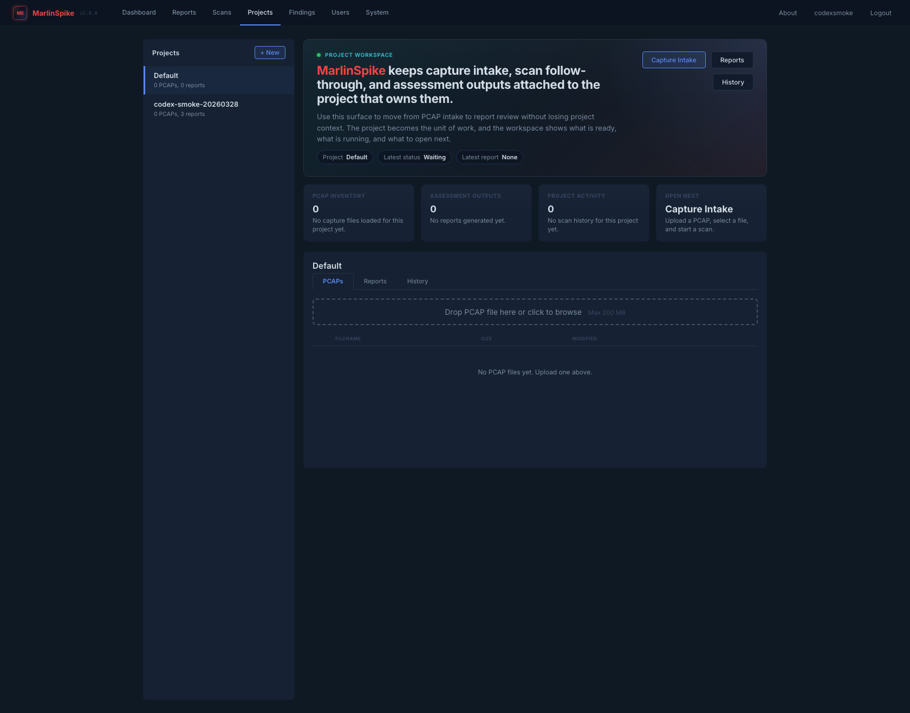

### Project Overview Tab (Cross-Report Aggregation):
When opening a project, the **Project Overview** tab automatically rolls up and deduplicates data across every capture file in the engagement:
* **MAC-Keyed Asset Deduplication**: Merges multi-day sightings into single, unified asset records with `first_seen_report` and `last_seen_report` tracking.
* **Finding Deduplication & Severity Promotion**: Combines identical finding tuples `(category, nodes, edges)` and promotes severity to the highest observed tier.
* **Cross-Report Statistics**: Displays rolled-up KPI cards, protocol byte distribution, and ATT&CK coverage chips.

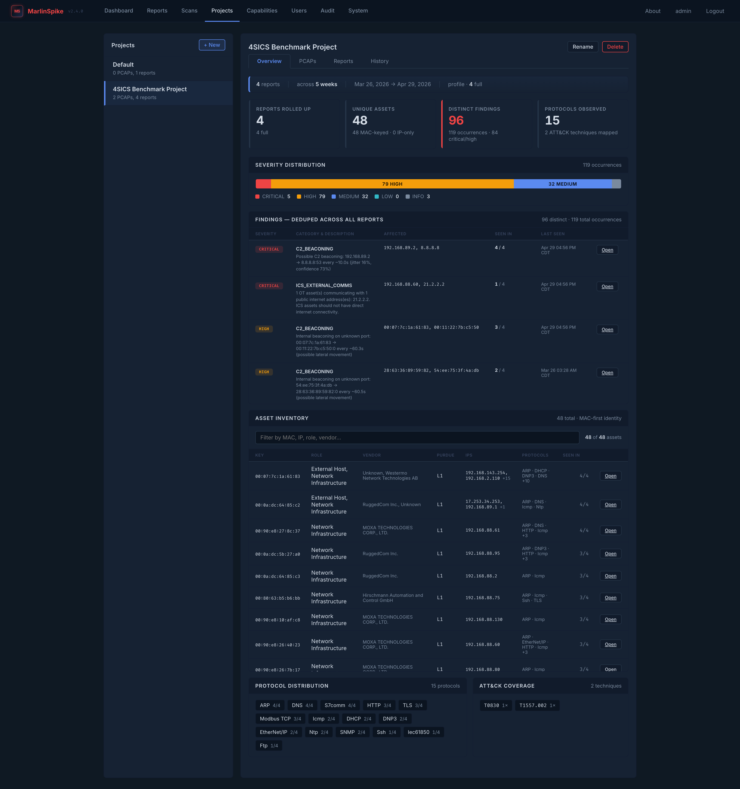

---

## 4. PCAP Ingestion, Live Capture & Fleet Agents

### A. Ad-Hoc PCAP Upload & Scan Execution
1. Navigate to the **Scans** page or click **New Scan** inside a project.
2. Select your `.pcap` or `.pcapng` capture file.
3. Configure optional scan parameters:
   - **Subnet Map Override**: Define custom Purdue level boundaries.
   - **Ephemeral Port Suppression**: Suppress noisy high-port ephemeral client flows.
4. Click **Run Scan**. Large PCAPs are automatically streamed and chunked with real-time stage feedback (*Ingest → Dissect → Classify → Report*).

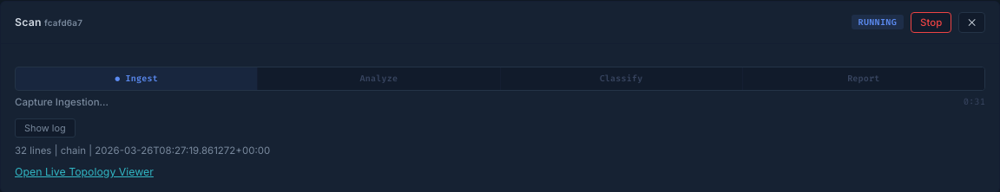

### B. Live Capture Sidecar (`marlinspike-capd`)
For continuous field collection on Linux hosts:
* Select an active physical network interface (NIC).
* Enter a BPF capture filter (e.g. `tcp port 502 or udp port 44818`).
* Set rolling ring buffer size (default: 2 GB). Rotated PCAP files automatically land in the project as active scans.

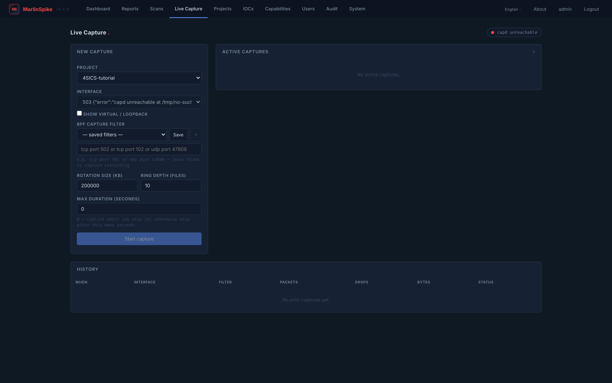

### C. Fleet — Remote Sensor Agents (`marlinspike-agent`)
For distributed multi-tap plant floor monitoring:
* Enroll remote lightweight `marlinspike-agent` processes over mTLS.
* Remote traffic is securely forwarded back to the central gateway and analyzed within the assigned project.
* Configure project-wide recurring capture schedules (e.g. daily 08:00 UTC captures).

---

## 5. The Analyst Workbench & Topology Viewer

The **Analyst Workbench** is the core operational surface for triaging passive network captures. It combines a high-performance SVG/Canvas topology map, a dockable relational inspector, and a slide-up data drawer.

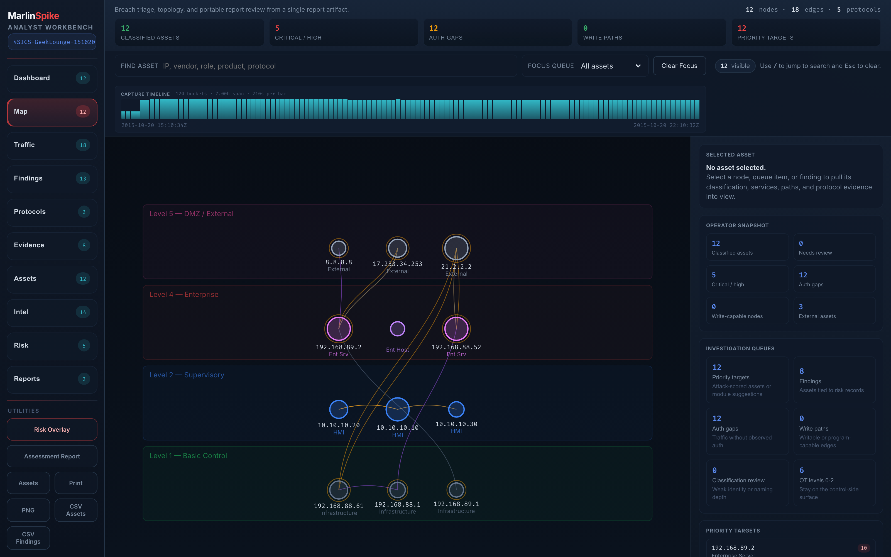

### Multi-Lens Relational Graphing:
Use the **Lens Strip** at the top of the map to switch graph perspectives:
* 🌐 **Comms**: Host-to-host conversation flows colored by Purdue model hierarchy.
* 🚨 **Findings**: Severity-sorted card overlay highlighting anomalous paths.
* 🎯 **IOC**: Halo highlights on assets matching threat intelligence indicators.
* 🛡️ **ATT&CK**: Matrix grid grouping active tactics and mapped ICS techniques.
* 📈 **Baseline**: Per-asset novelty cards flagging newly observed traffic vs historical baselines.
* 👥 **Peers**: Role, Vendor, and Purdue grouping with contextual anomaly indicators.

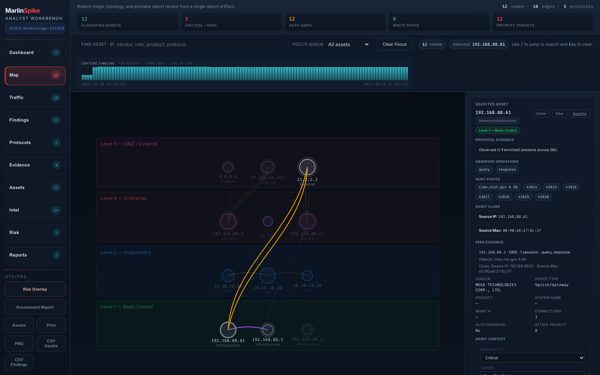

---

### High-Performance HMI (HP-HMI) Mode
Based on **ANSI/ISA-101.01** and **ASM Consortium** guidelines, clicking **[HP-HMI]** in the toolbar switches the entire interface to High-Performance HMI mode:
* **Color Suppression**: Normal, healthy OT assets (PLCs, HMIs, IEDs) desaturate to neutral dark grey tones.
* **Visual Focus**: Bright **Red (Critical)** and **Amber (High)** glow rings strictly reserve color for active alarms, unauthorized Modbus writes, or cross-zone violations.

---

### Time Scrubbing & Sub-PCAP Extraction
1. Below the toolbar, view the interactive **Packet Rate Histogram**.
2. Click and drag to scrub across a specific timeframe.
3. All workbench panes, conversations, and asset views instantly filter to the selected window.
4. Click **Extract Sub-PCAP** to download a carved `.pcap` containing only packets from that exact window.

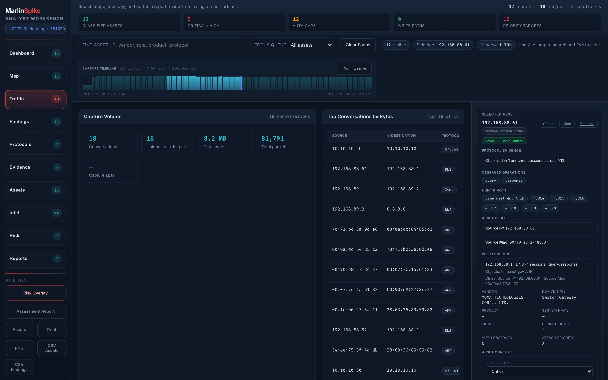

---

## 6. Threat Intelligence & IOC Threat Hunting

Navigate to the **IOCs** page to manage indicator lists and run cross-report threat hunts.

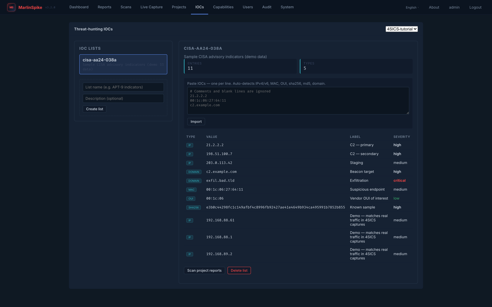

### Features & Supported Indicators:
* **Bulk Import**: Paste raw indicators; the parser automatically categorizes IPv4/v6, MAC addresses, OUIs, SHA-256/MD5 hashes, and domain names (including `*.wildcard.com` patterns).
* **Cross-Report Scan**: Scans every report in a project against active indicators.
* **Match Surface Table**: Surfaces hits across affected nodes, conversations, C2 indicators, and malware payloads.

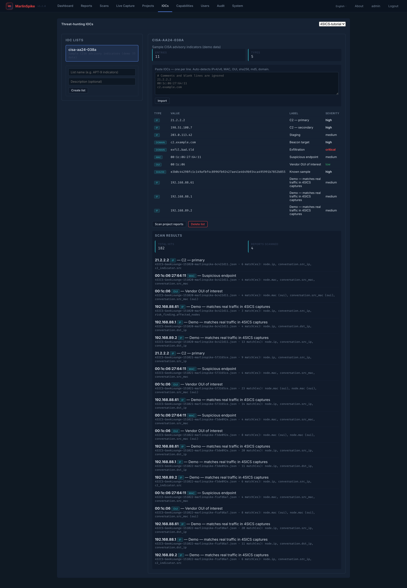

---

## 7. Vulnerability Management & CISA KEV Correlation

Marlinspike automatically correlates passively extracted PLC hardware models, order numbers, and firmware versions against active vulnerability databases:

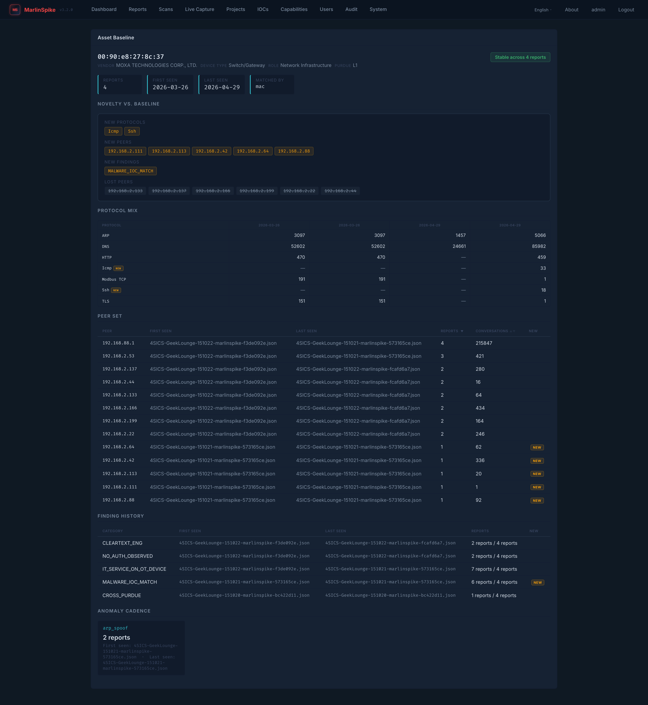

### Key Capabilities:
* **CISA KEV Matching**: Surfaces glowing `🔥 CISA KEV: Actively Exploited` badges on hardware subject to known exploited vulnerabilities.
* **CVSS v3.1 Quantitative Risk Scores**: Calculates numeric CVSS impact scores (`9.8 CRITICAL`, `8.1 HIGH`, etc.).
* **Vulnerability Lifecycle Tracking**: Update finding triage states (*Open*, *In Progress*, *False Positive*, *Risk Accepted*, *Resolved / Patched*) directly inside the report viewer.

---

## 8. MITRE ATT&CK® for ICS & Detection Coverage

Marlinspike integrates the complete **MITRE ATT&CK for ICS** and **Enterprise** frameworks via the `marlinspike-mitre` engine.

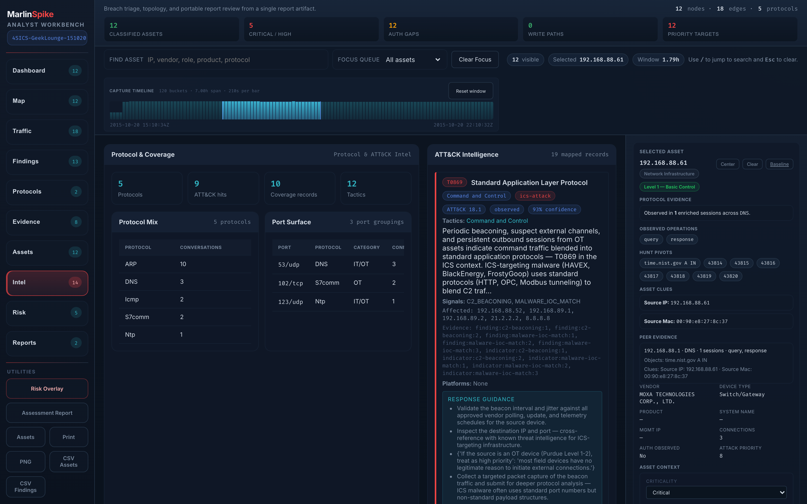

### Features:
* **Tactic Matrix**: View findings grouped under ATT&CK tactics (*Initial Access*, *Execution*, *Evasion*, *Inhibit Response Function*, *Impair Process Control*).
* **Remediation Guidance**: Includes actionable response steps aligned with **IEC 62443 System Requirements**.
* **Capabilities Catalog (`/capabilities`)**: A built-in source catalog detailing all protocol dissectors, rule packs, and detection capabilities available in your instance.

---

## 9. Enterprise Export & Incident Response Pipelines

Marlinspike provides enterprise security export pipelines directly accessible from the Report Viewer and IOC pages:

### A. OASIS STIX 2.1 Threat Intel Exporter
* **How to export**: Click **📦 Export STIX 2.1** on the `/iocs` page or access `/api/reports/<filename>/stix`.
* **Output**: OASIS-compliant STIX 2.1 JSON bundle containing `Indicator`, `Infrastructure`, and `Observed-Data` STIX domain objects for direct ingest into MISP, OpenCTI, or enterprise SIEMs.

### B. Automated Ansible Incident Response Playbooks
* **How to export**: Click **⚡ Ansible Playbook** in the Report Viewer pane or access `/api/reports/<filename>/ansible`.
* **Output**: Executable YAML Ansible playbook (`marlinspike_incident_response_playbook.yml`) configured to automate port shutdown and micro-segmentation across:
  - **Palo Alto Networks** (PAN-OS XML API security rules)
  - **Cisco IOS Switches** (Interface shutdown / VLAN isolation ACLs)
  - **Linux Gateways** (`iptables` containment rules)

### C. Zero-Trust Firewall ACL Exporter
* **How to export**: Click **🛡️ Firewall Rules** in the Report Viewer toolbar.
* **Output**: Native vendor ACL syntax (*Palo Alto*, *Fortinet FortiGate*, *Cisco ASA*, *Linux iptables*) derived from observed cross-Purdue flows.

### D. PCAP Patch Verification & Diff Engine
* **How to export**: Click **🔄 Compare PCAP** in the utility bar.
* **Output**: Comparative delta report comparing baseline vs post-patch PCAPs to prove vulnerability remediation (`Resolved`, `Persistent`, `New Risks`).

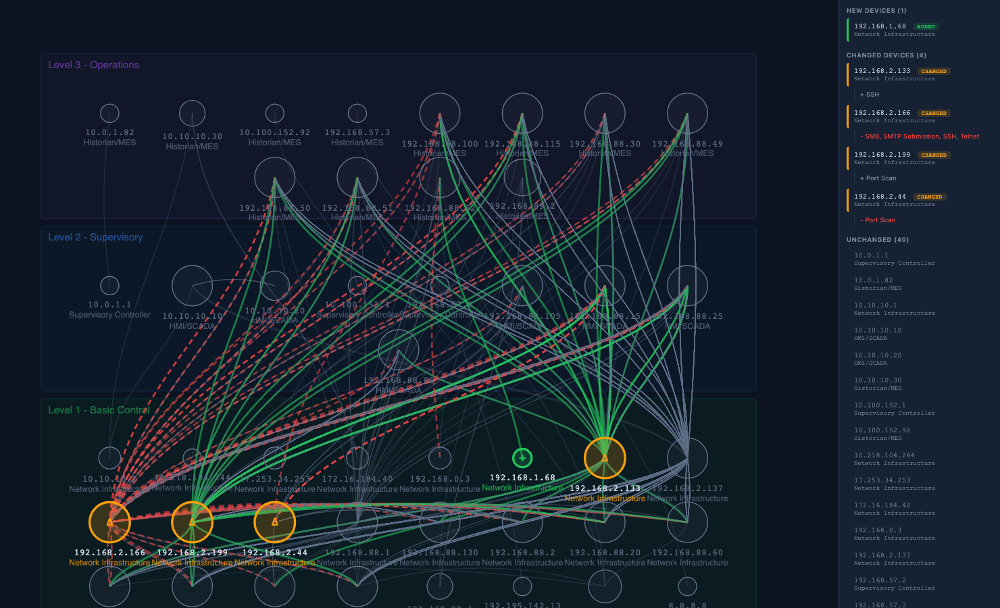

---

## 10. Administration, Role-Based Access & Audit Logging

Administrators can manage users, monitor platform health, and inspect audit logs.

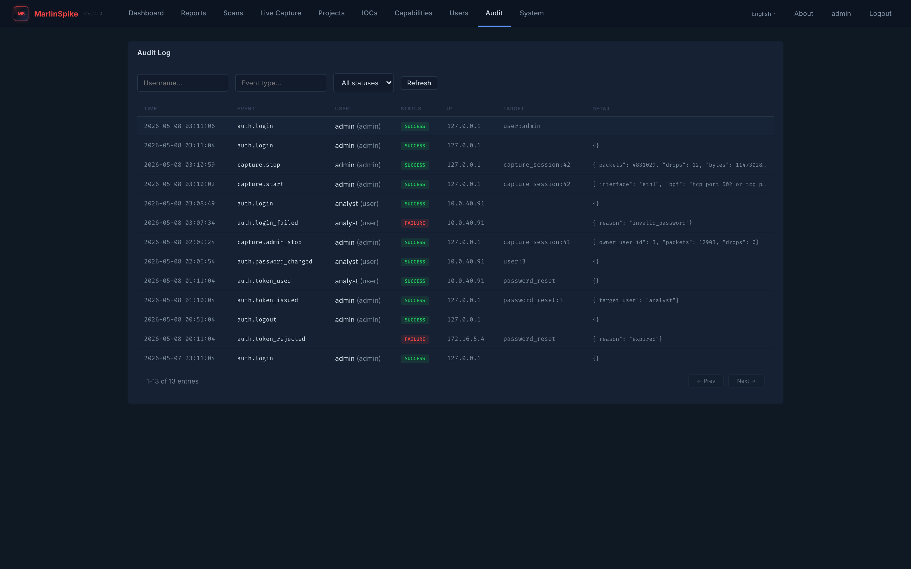

### Administrative Workflows:
* **User Management**: Add users, set roles, adjust storage limits, and trigger secure password resets.
* **Audit Trail (`/audit`)**: Inspect paginated logs of all authentication attempts (`auth.login`, `auth.logout`) and capture actions (`capture.upload`, `scan.start`).
* **System Health (`/system`)**: Monitor CPU, RAM, disk usage, active background scan processes, and database pool status.

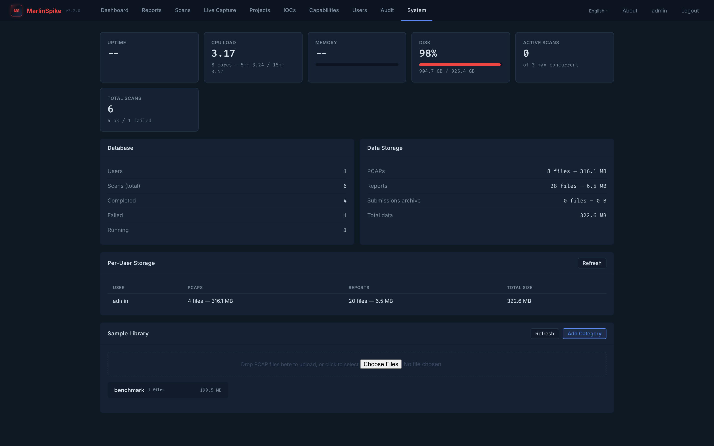

---

*End of MarlinSpike User Manual (v3.8.0).*
